## Hi there 👋

<!--
**RamyBelala/RamyBelala** is a ✨ _special_ ✨ repository because its `README.md` (this file) appears on your GitHub profile.

Here are some ideas to get you started:

- 🔭 I’m currently working on ...
- 🌱 I’m currently learning ...
- 👯 I’m looking to collaborate on ...
- 🤔 I’m looking for help with ...
- 💬 Ask me about ...
- 📫 How to reach me: ...
- 😄 Pronouns: ...
- ⚡ Fun fact: ...
-->
<p align="center">
  
</p>

<p align="center">
  
</p>

<h3 align="center">Computer Science student · Cybersecurity enthusiast · Purple Teamer in training</h3>

<br/>

## About Me

- 🎓 Computer Science student at **ESTIN**, currently in year 3 of 5
- 🛡️ President of **Nexus**, my school's cybersecurity club, this year
- 🚀 One of 5 co-founders of **NEONHAT** — a platform for learning cybersecurity by playing CTFs through connected levels in themed arenas
- 🚩 CTF player on team **cascroot** — mainly OSINT and digital forensics (4n6)
- ✍️ CTF challenge author for multiple cybersecurity events
- 🎯 Currently focused on penetration testing and digital forensics, working toward becoming an elite **purple teamer**
- 💻 Backend web developer, currently learning frontend development
- 💬 Ask me about pentesting, 4n6, CTFs, or backend dev — happy to talk shop

<br/>

## 🔭 Currently

```bash
$ cat ./focus.txt
> Penetration Testing
> Digital Forensics (4n6)
> Purple Teaming — long-term goal
```

<br/>

## 🏆 CTFs & Cybersecurity

| | |
|---|---|
| **Team** | cascroot |
| **Categories** | OSINT, Digital Forensics (4n6) |
| **Role** | Player & challenge author |
| **Club** | President of Nexus (cybersecurity club, ESTIN) |

<br/>

## 🕹️ NEONHAT

A cybersecurity learning platform I co-founded with 4 others — learn by playing CTFs through connected levels inside themed arenas (4n6, crypto, and more), plus a **gym** mode to test your skills or compete against others.

**My role:**
- Came up with the concept for the whole platform
- Architected the site structure
- Built all the challenges and lessons, with their solutions
- Designed the leveling system

The rest of the team built the frontend, backend, and design.

<br/>

## 🛠️ Tech Stack

**Backend**

    

**Languages**

  

**Currently learning**


<br/>

## 📊 GitHub Stats

<p align="center">
  
  
</p>

<br/>

## 📫 Connect

- GitHub: [@N3r0](https://github.com/N3r0)
- Email: _add yours here_
- LinkedIn: _add yours here_

<br/>

<p align="center"><sub>N3r0@github ~$ <i>█</i></sub></p>
